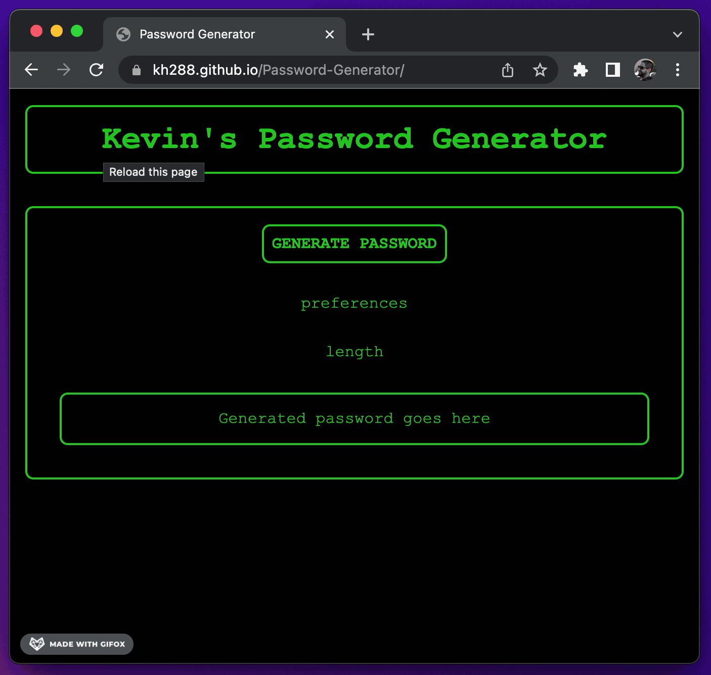

# Password-Generator

This project is designed to create a password that is strong and meets a specific criteria.
This program is able to individually input 4 parameters (Symbols, Numbers, Uppercase, and lowercase letters) to generate a great strong password per your preference!

<ul>
<li>This program has the capability of making a password 128 characters long!</li>
<li>This password generator is able to meet very strong password criterias</li>
<li>The generate button glows? neat, also edgy hacker theme I suppose!</li>
<li>If you're using a bad password, you dont have to, generate something strong so you dont get your password guessed</li>
</ul>

Here's the website, check it out! https://kh288.github.io/Password-Generator/
 
 
[LICENSE](/LICENSE.txt)